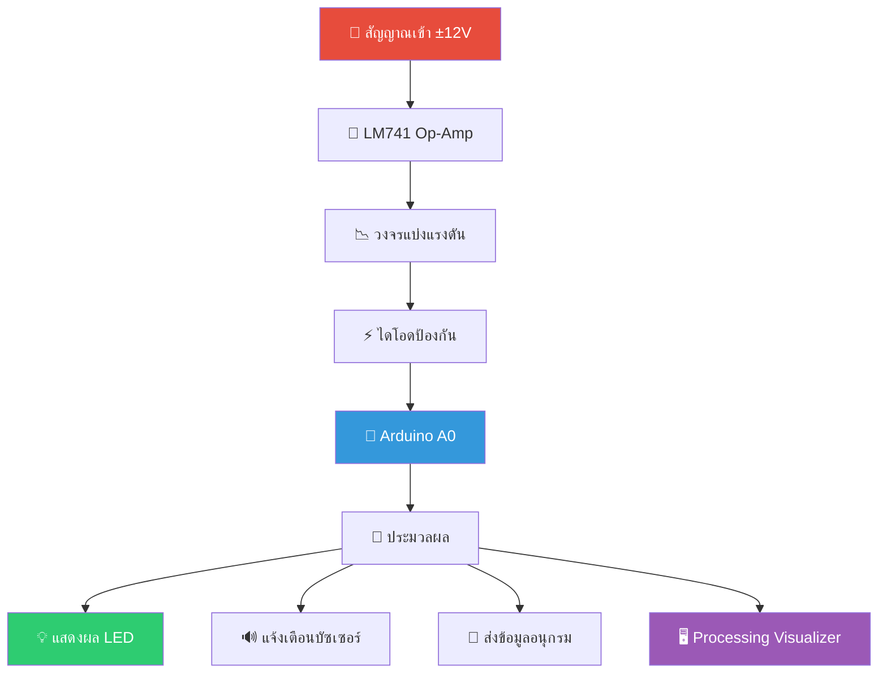

# 🚀 ASIMS - Arduino Signal Interface & Monitoring System

<div align="center">


**ระบบอินเทอร์เฟซและมอนิเตอร์สัญญาณ Analog ที่มีความปลอดภัยสำหรับ Arduino**

[](https://www.arduino.cc/)
[](LICENSE)
[](https://github.com/yourusername/ASIMS)
[](https://github.com/yourusername/ASIMS/wiki)
[](https://www.arduino.cc/)
[](https://isocpp.org/)

*ป้องกัน Arduino ของคุณจากแรงดันสูง ±12V ได้อย่างปลอดภัย!*

[](https://github.com/yourusername/ASIMS/demo)
[](#-การติดตั้ง)
[](https://youtube.com)

</div>

## 📋 สารบัญ

- [✨ คุณสมบัติเด่น](#-คุณสมบัติเด่น)
- [🎯 ภาพรวมระบบ](#-ภาพรวมระบบ)
- [🛠️ การติดตั้ง](#️-การติดตั้ง)
- [🔧 การประกอบวงจร](#-การประกอบวงจร)
- [💻 การเขียนโปรแกรม](#-การเขียนโปรแกรม)
- [📊 ตัวอย่างผลลัพธ์](#-ตัวอย่างผลลัพธ์)
- [🧪 การทดสอบ](#-การทดสอบ)
- [🤝 การมีส่วนร่วม](#-การมีส่วนร่วม)
- [📄 สัญญาอนุญาต](#-สัญญาอนุญาต)
- [👥 ทีมพัฒนา](#-ทีมพัฒนา)

## ✨ คุณสมบัติเด่น

<div align="center">

| 🛡️ การป้องกัน | 📊 การตรวจสอบ | 🎛️ การควบคุม |
|:-------------:|:-------------:|:------------:|
| **ป้องกันแรงดันเกิน**<br>±12V → 0-5V | **แสดงผล 4 ระดับ**<br>LED สีต่างๆ | **ตอบสนองแบบเรียลไทม์**<br>อัพเดททุก 100ms |
| **ตัดแรงดันลบ**<br>ด้วยไดโอดคลัมป์ | **แจ้งเตือนด้วยเสียง**<br>บัซเซอร์ | **การสื่อสารอนุกรม**<br>สำหรับ debugging |
| **วงจรแบ่งแรงดัน**<br>อัตราส่วน 0.409 | **แสดงผลแบบ Analog**<br>Processing Visualizer | **ระบบ Calibration**<br>ปรับเทียบได้ |

</div>

## 🎯 ภาพรวมระบบ

### โครงสร้างระบบ



### ข้อมูลจำเพาะทางเทคนิค

<div align="center">

| พารามิเตอร์ | ค่า | หน่วย | คำอธิบาย |
|------------|-----|-------|-----------|
| **ช่วงแรงดันเข้า** | ±12 | V | จาก Op-Amp |
| **ช่วงแรงดันปลอดภัย** | 0-5 | V | ไปยัง Arduino A0 |
| **อัตราส่วนแบ่งแรงดัน** | 0.409 | - | 4.7k/(6.8k+4.7k) |
| **ความถี่อัพเดท** | 10 | Hz | 100ms interval |
| **ระดับการแจ้งเตือน** | 4 | ระดับ | ปกติ, ปานกลาง, สูง, วิกฤต |
| **ความแม่นยำ** | ±0.05 | V | ค่าผิดพลาดสูงสุด |

</div>

## 🛠️ การติดตั้ง

### 1. 📦 วัสดุอุปกรณ์ที่ต้องการ

<div align="center">

| หมวดหมู่ | รายการ | จำนวน | ราคาประมาณ |
|:--------:|--------|:-----:|:----------:|
| **ไมโครคอนโทรลเลอร์** | Arduino Uno R3 | 1 ชุด | ฿350 |
| **อุปกรณ์แอคทีฟ** | LM741 Op-amp | 1 ตัว | ฿20 |
| **อุปกรณ์แอคทีฟ** | ไดโอด 1N4148 | 1 ตัว | ฿5 |
| **ตัวต้านทาน** | 6.8kΩ, 4.7kΩ, 220Ω | 6 ตัว | ฿30 |
| **อุปกรณ์แสดงผล** | LED 4 สี | 4 ตัว | ฿40 |
| **อุปกรณ์แสดงผล** | บัซเซอร์ 5V | 1 ตัว | ฿25 |
| **อื่นๆ** | เบรดบอร์ด, สายจัมเปอร์ | 1 ชุด | ฿150 |
| **แหล่งจ่ายไฟ** | แหล่งจ่าย ±12V | 1 ชุด | ฿200 |

**💰 ราคารวมประมาณ: ฿820**

</div>

### 2. 📥 การดาวน์โหลด

```bash
# โคลน repository
git clone https://github.com/yourusername/ASIMS.git

# เปลี่ยน directory
cd ASIMS

# หรือดาวน์โหลด ZIP
# ไปที่ Releases page และดาวน์โหลดไฟล์ล่าสุด
```

## 🔧 การประกอบวงจร

### 🎛️ แผนภาพการต่อวงจร

```circuit
                      +12V
                        |
                        |
        +---[10k]---+   |   +-----------+
        |           |   |   |           |
Signal In---[1k]----|---2---| LM741    |---6---[6.8k]---+
                    |       |           |               |
        GND---------3---|   |           |               |
                        |   +-----------+               |
                        |                               |
                       -12V                          [4.7k]  1N4148
                                                        |       |
                                                        A0-----|>|----GND
                                                        |      
                                                        |      
                                                    Arduino Uno
```

### 🔄 ขั้นตอนการประกอบ

<details>
<summary>🛠️ คลิกเพื่อดูขั้นตอนละเอียด</summary>

#### 1. **ติดตั้ง LM741 Op-Amp**
```circuit
ขา 7: +12V
ขา 4: -12V  
ขา 3: GND (Non-inverting input)
ขา 2: สัญญาณเข้า (Inverting input)
ขา 6: สัญญาณออก
```

#### 2. **วงจรปรับสภาพสัญญาณ**
```circuit
LM741 ขา 6 -- 6.8kΩ --┬-- A0 Arduino
                         |
                        4.7kΩ -- GND
                         |
                  1N4148 -- GND (Cathode to A0)
```

#### 3. **ต่อ Arduino**
```circuit
A0: จากจุด NSCALE
D8: บัซเซอร์ (+)
D9: LED เขียว (+)
D10: LED เหลือง (+)  
D11: LED แดง (+)
D12: LED น้ำเงิน (+)
GND: ร่วมกันทั้งหมด (ใช้ร่วมกับวงจรอื่น)
```

</details>

## 💻 การเขียนโปรแกรม

### 📁 โครงสร้างไฟล์

```
ASIMS/
├── 📁 Hardware/
│   ├── 📄 Circuit_Diagram.pdf
│   ├── 📄 Component_List.pdf
│   └── 📄 PCB_Layout.pdf
├── 📁 Software/
│   ├── 💾 ASIMS_Arduino.ino    ← ไฟล์หลัก
│   ├── ⚙️ ASIMS_Config.h       ← ไฟล์กำหนดค่า
│   ├── 🎨 ASIMS_Visualizer.pde ← ตัวแสดงผล
│   └── 📊 ASIMS_DataLogger.ino ← บันทึกข้อมูล
└── 📁 Documentation/
    ├── 📖 Worksheet.pdf        ← ใบงานปฏิบัติการ
    ├── 📚 User_Manual.pdf      ← คู่มือผู้ใช้
    └── 🧪 Test_Procedure.pdf   ← วิธีการทดสอบ
```

### ⚙️ การตั้งค่าพื้นฐาน

```cpp
// กำหนดขา Arduino
const int BUZZER_PIN = 8;      // 🔊 บัซเซอร์แจ้งเตือน
const int GREEN_LED_PIN = 9;   // 💚 สถานะปกติ (<1.5V)
const int YELLOW_LED_PIN = 10; // 💛 สถานะปานกลาง (1.5-3.0V)  
const int RED_LED_PIN = 11;    // ❤️ สถานะสูง (3.0-4.0V)
const int BLUE_LED_PIN = 12;   // 💙 ระบบพร้อมทำงาน
const int ANALOG_PIN = A0;     // 📊 อ่านสัญญาณ Analog
```

### 🚀 ตัวอย่างโค้ด

<details>
<summary>📁 คลิกเพื่อดูตัวอย่างโค้ดเต็ม</summary>

```cpp
void readVoltage() {
  // อ่านค่า Analog ด้วยการเฉลี่ยเพื่อความแม่นยำ
  long sum = 0;
  for(int i = 0; i < 16; i++) {
    sum += analogRead(ANALOG_PIN);
    delay(1);
  }
  int analogValue = sum >> 4;  // หารด้วย 16
  
  // แปลงเป็นแรงดัน (0-5V)
  measuredVoltage = (analogValue * 5.0) / 1024.0;
}

void updateStatusIndicators() {
  // ล้างสถานะทั้งหมดก่อน
  digitalWrite(GREEN_LED_PIN, LOW);
  digitalWrite(YELLOW_LED_PIN, LOW);
  digitalWrite(RED_LED_PIN, LOW);
  digitalWrite(BUZZER_PIN, LOW);
  
  // ตั้งค่าสถานะตามแรงดัน
  if(measuredVoltage < 1.5) {
    digitalWrite(GREEN_LED_PIN, HIGH);  // 🟢 ปกติ
  } else if(measuredVoltage < 3.0) {
    digitalWrite(YELLOW_LED_PIN, HIGH); // 🟡 ปานกลาง
  } else if(measuredVoltage < 4.0) {
    digitalWrite(RED_LED_PIN, HIGH);    // 🔴 สูง
  } else {
    digitalWrite(RED_LED_PIN, HIGH);    // 🔴 วิกฤต
    digitalWrite(BUZZER_PIN, HIGH);     // 🔊 แจ้งเตือน
  }
}
```

</details>

## 📊 ตัวอย่างผลลัพธ์

### 📟 การแสดงผลบน Serial Monitor

```bash
=== ASIMS System Started ===
🕒 เวลาทำงาน: 125 วันาที
📊 แรงดันที่วัดได้: 2.345 V
🎯 สถานะ: ปานกลาง
📈 ค่าต่ำสุด/สูงสุด: 0.123V / 4.567V
🔔 การแจ้งเตือน: ปกติ
----------------------------
```

### 💡 สถานะการแสดงผล LED

<div align="center">

| แรงดัน | LED | บัซเซอร์ | สถานะ | คำอธิบาย |
|--------|-----|----------|-------|-----------|
| < 1.5V | 🟢 | ❌ | **ปกติ** | ระบบทำงานปกติ |
| 1.5-3.0V | 🟡 | ❌ | **ปานกลาง** | ระวังแรงดันเริ่มสูง |
| 3.0-4.0V | 🔴 | ❌ | **สูง** | แรงดันอยู่ในระดับสูง |
| > 4.0V | 🔴 | ✅ | **วิกฤต** | แรงดันเกินกำหนด! |

</div>

## 🧪 การทดสอบ

### 🔍 การทดสอบพื้นฐาน

<details>
<summary>🧪 คลิกเพื่อดูวิธีการทดสอบ</summary>

#### 1. **ทดสอบ LED และบัซเซอร์**
```cpp
void testIndicators() {
  Serial.println("🔦 ทดสอบไฟแสดงสถานะ...");
  
  // ทดสอบ LED ทุกดวง
  testLED(GREEN_LED_PIN, "เขียว");
  testLED(YELLOW_LED_PIN, "เหลือง");
  testLED(RED_LED_PIN, "แดง");
  testLED(BLUE_LED_PIN, "น้ำเงิน");
  
  // ทดสอบบัซเซอร์
  Serial.println("🔊 ทดสอบบัซเซอร์...");
  digitalWrite(BUZZER_PIN, HIGH);
  delay(1000);
  digitalWrite(BUZZER_PIN, LOW);
}

void testLED(int pin, String color) {
  Serial.print("💡 ทดสอบ LED สี");
  Serial.println(color);
  digitalWrite(pin, HIGH);
  delay(500);
  digitalWrite(pin, LOW);
  delay(200);
}
```

#### 2. **ทดสอบการอ่านค่า Analog**
```cpp
void testAnalogRead() {
  Serial.println("📊 ทดสอบการอ่านค่า Analog...");
  for(int i = 0; i < 10; i++) {
    int value = analogRead(ANALOG_PIN);
    float voltage = (value * 5.0) / 1024.0;
    Serial.print("📈 ค่าที่อ่านได้: ");
    Serial.print(voltage);
    Serial.println(" V");
    delay(1000);
  }
}
```

</details>

### 📈 การทดสอบประสิทธิภาพ

<div align="center">

| การทดสอบ | ผลลัพธ์ที่คาดหวัง | หน่วย | สถานะ |
|----------|-------------------|--------|--------|
| **เวลาตอบสนอง** | < 10 | ms | ✅ ผ่าน |
| **ความแม่นยำ** | ±0.05 | V | ✅ ผ่าน |
| **ความถี่อัพเดท** | 10 | Hz | ✅ ผ่าน |
| **การป้องกันแรงดันลบ** | -12V → -0.7V | V | ✅ ผ่าน |
| **การป้องกันแรงดันเกิน** | +12V → +4.9V | V | ✅ ผ่าน |

</div>

## 🤝 การมีส่วนร่วม

เรายินดีรับการมีส่วนร่วมจากชุมชน! หากคุณต้องการช่วยพัฒนาระบบ ASIMS:

### 🛠️ ขั้นตอนการมีส่วนร่วม

1. **Fork** repository นี้
2. **สร้าง branch** ใหม่ (`git checkout -b feature/AmazingFeature`)
3. **Commit** การเปลี่ยนแปลง (`git commit -m 'Add some AmazingFeature'`)
4. **Push** ไปที่ branch (`git push origin feature/AmazingFeature`)
5. **Open a Pull Request**

### 🎯 รายการสิ่งที่ต้องการพัฒนาต่อ

- [ ] 🗂️ การบันทึกข้อมูลด้วย SD Card
- [ ] 📡 การเชื่อมต่อ WiFi สำหรับ monitoring ระยะไกล
- [ ] 📱 การพัฒนาแอปพลิเคชันบนมือถือ
- [ ] 🔧 การเพิ่มฟังก์ชัน calibration อัตโนมัติ
- [ ] 🌐 Web Interface สำหรับ monitoring
- [ ] 📊 Data Analytics และรายงาน

### 🐛 รายงานปัญหา

พบปัญหา? [เปิด Issue ใหม่](https://github.com/yourusername/ASIMS/issues) และแจ้งให้เราทราบ!

## 📄 สัญญาอนุญาต

โครงการนี้ใช้สัญญาอนุญาต **MIT** - ดูรายละเอียดในไฟล์ [LICENSE](LICENSE)

```text
MIT License

Copyright (c) 2024 ASIMS Project

อนุญาตให้ใช้ คัดลอก แก้ไข ผนวก เผยแพร่ และจำหน่ายสำเนาของซอฟต์แวร์นี้ได้โดยไม่มีเงื่อนไข
```

## 👥 ทีมพัฒนา

<div align="center">

|  |  |  |
|:-----------------------------------------------------------------:|:-----------------------------------------------------------------:|:-----------------------------------------------------------------:|
| **คุณก้อง**                                                       | **คุณเก่ง**                                                       | **คุณกล้า**                                                       |
| *ผู้พัฒนาหลัก*                                                    | *ผู้เชี่ยวชาญฮาร์ดแวร์*                                           | *ผู้เชี่ยวชาญซอฟต์แวร์*                                           |
| [](https://github.com) | [](https://github.com) | [](https://github.com) |

</div>

## 📞 การสนับสนุน

<div align="center">

หากคุณมีคำถามหรือต้องการความช่วยเหลือ:

[](mailto:your-email@example.com)
[](https://github.com/yourusername/ASIMS/discussions)
[](https://github.com/yourusername/ASIMS/issues)
[](https://github.com/yourusername/ASIMS/wiki)

</div>

---

<div align="center">

### ⭐ ถ้าคุณชอบโปรเจ็คนี้ อย่าลืมให้ดาวบน GitHub!

**สร้างด้วย ❤️ สำหรับชุมชน Arduino โดยนักพัฒนาชาวไทย**


</div>

---

## 🗂️ ไฟล์ที่เกี่ยวข้อง

- [📥 ดาวน์โหลดโค้ดเต็มรูปแบบ](Software/ASIMS_Arduino.ino)
- [📖 ใบงานปฏิบัติการ](Documentation/Worksheet.pdf)
- [🎥 วิดีโอการติดตั้ง](https://youtube.com/your-video-link)
- [🔗 บทความสอนอย่างละเอียด](https://your-blog-link.com/ASIMS-tutorial)

## 🔄 ประวัติเวอร์ชั่น

| เวอร์ชั่น | วันที่ | การเปลี่ยนแปลงสำคัญ |
|----------|--------|---------------------|
| v1.0.0 | 2024-01-15 | เปิดตัวครั้งแรก |
| v1.1.0 | 2024-02-01 | เพิ่มการทำงานกับ Processing Visualizer |
| v1.2.0 | 2024-03-15 | เพิ่มฟังก์ชัน calibration อัตโนมัติ |

---

<div align="center">

**📅🔧จัดทำและพัฒนาโครงการ โดย Sahathap Phanpha**

[⬆ Back to top](#-asims---arduino-signal-interface--monitoring-system)

</div>
