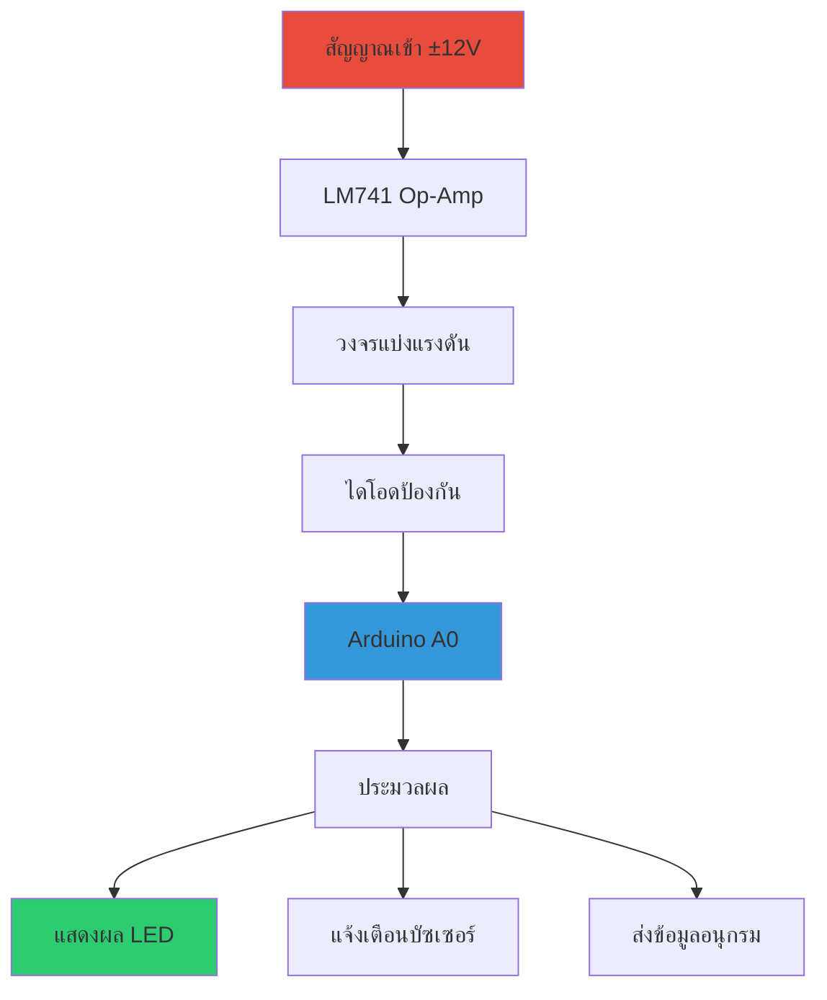

# 🚀 ASIMS (Arduino Signal Interface & Monitoring System)
(อินเทอร์เฟซสัญญาณ Arduino และระบบตรวจสอบ)
<div align="center">

[

**ระบบอินเทอร์เฟซและมอนิเตอร์สัญญาณ Analog ที่มีความปลอดภัยสำหรับ Arduino**

[](https://www.arduino.cc/)
[](LICENSE)
[](https://github.com/yourusername/ASIMS)
[](https://github.com/yourusername/ASIMS/wiki)

*ป้องกัน Arduino ของคุณจากแรงดันสูง ±12V ได้อย่างปลอดภัย!*

</div>

## 📋 เนื้อหา

- [✨ คุณสมบัติ](#-คุณสมบัติ)
- [🎯 ภาพรวมระบบ](#-ภาพรวมระบบ)
- [🛠️ การติดตั้ง](#️-การติดตั้ง)
- [🔧 การประกอบวงจร](#-การประกอบวงจร)
- [💻 การเขียนโปรแกรม](#-การเขียนโปรแกรม)
- [📊 ตัวอย่างผลลัพธ์](#-ตัวอย่างผลลัพธ์)
- [🧪 การทดสอบ](#-การทดสอบ)
- [🤝 การมีส่วนร่วม](#-การมีส่วนร่วม)
- [📄 สัญญาอนุญาต](#-สัญญาอนุญาต)

## ✨ คุณสมบัติ

<div align="center">

| 🛡️ การป้องกัน | 📊 การตรวจสอบ | 🎛️ การควบคุม |
|:---:|:---:|:---:|
| **ป้องกันแรงดันเกิน**<br>±12V → 0-5V | **แสดงผล 4 ระดับ**<br>LED สีต่างๆ | **ตอบสนองแบบเรียลไทม์**<br>อัพเดททุก 100ms |
| **ตัดแรงดันลบ**<br>ด้วยไดโอดคลัมป์ | **แจ้งเตือนด้วยเสียง**<br>บัซเซอร์ | **การสื่อสารอนุกรม**<br>สำหรับ debugging |

</div>

## 🎯 ภาพรวมระบบ

### โครงสร้างระบบ



### ข้อมูลจำเพาะทางเทคนิค

| พารามิเตอร์ | ค่า | คำอธิบาย |
|-----------|-----|-----------|
| ช่วงแรงดันเข้า | ±12V | จาก Op-Amp |
| ช่วงแรงดันปลอดภัย | 0-5V | ไปยัง Arduino A0 |
| อัตราส่วนแบ่งแรงดัน | 0.409 | 4.7k/(6.8k+4.7k) |
| ความถี่อัพเดท | 10 Hz | 100ms interval |
| ระดับการแจ้งเตือน | 4 ระดับ | ปกติ, ปานกลาง, สูง, วิกฤต |

## 🛠️ การติดตั้ง

### 1. วัสดุอุปกรณ์ที่ต้องการ

<div align="center">

| หมวดหมู่ | รายการ | จำนวน |
|:--------:|--------|:-----:|
| **ไมโครคอนโทรลเลอร์** | Arduino Uno R3 | 1 ชุด |
| **อุปกรณ์แอคทีฟ** | LM741 Op-amp, 1N4148 Diode | 1-2 ตัว |
| **ตัวต้านทาน** | 6.8kΩ, 4.7kΩ, 220Ω | 6 ตัว |
| **อุปกรณ์แสดงผล** | LED 4 สี, บัซเซอร์ | 5 ตัว |
| **อื่นๆ** | เบรดบอร์ด, สายจัมเปอร์ | 1 ชุด |

</div>

### 2. การดาวน์โหลด

```bash
# โคลน repository
git clone https://github.com/yourusername/ASIMS.git

# หรือดาวน์โหลด ZIP
# ไปที่ Releases page และดาวน์โหลดไฟล์ล่าสุด
```

## 🔧 การประกอบวงจร

### แผนภาพการต่อวงจร

```
                      +12V
                        |
                        |
        +---[10k]---+   |   +-----------+
        |           |   |   |           |
Signal In---[1k]----|---2---| LM741    |---6---[6.8k]---+
                    |       |           |               |
        GND---------3---|   |           |               |
                        |   +-----------+               |
                        |                               |
                       -12V                          [4.7k]  1N4148
                                                        |       |
                                                        A0-----|>|----GND
                                                        |      
                                                        |      
                                                    Arduino Uno
```

### ขั้นตอนการประกอบ

1. **ติดตั้ง LM741 Op-Amp**
   ```circuit
   ขา 7: +12V
   ขา 4: -12V  
   ขา 3: GND (Non-inverting input)
   ขา 2: สัญญาณเข้า (Inverting input)
   ขา 6: สัญญาณออก
   ```

2. **วงจรปรับสภาพสัญญาณ**
   ```circuit
   LM741 ขา 6 -- 6.8kΩ --┬-- A0 Arduino
                         |
                        4.7kΩ -- GND
                         |
                  1N4148 -- GND (Cathode to A0)
   ```

3. **ต่อ Arduino**
   ```circuit
   A0: จากจุด NSCALE
   D8: บัซเซอร์
   D9: LED เขียว
   D10: LED เหลือง  
   D11: LED แดง
   D12: LED น้ำเงิน
   GND: ร่วมกันทั้งหมด
   ```

## 💻 การเขียนโปรแกรม

### โครงสร้างไฟล์

```
ASIMS/
├── 📁 Hardware/
│   ├── Circuit_Diagram.pdf
│   └── Component_List.pdf
├── 📁 Software/
│   ├── ASIMS_Arduino.ino    ← ไฟล์หลัก
│   ├── ASIMS_Config.h       ← ไฟล์กำหนดค่า
│   └── ASIMS_Visualizer.pde ← ตัวแสดงผล
└── 📁 Documentation/
    ├── Worksheet.pdf        ← ใบงานปฏิบัติการ
    └── User_Manual.pdf      ← คู่มือผู้ใช้
```

### การตั้งค่าพื้นฐาน

```cpp
// กำหนดขา Arduino
const int BUZZER_PIN = 8;
const int GREEN_LED_PIN = 9;   // สถานะปกติ (<1.5V)
const int YELLOW_LED_PIN = 10; // สถานะปานกลาง (1.5-3.0V)  
const int RED_LED_PIN = 11;    // สถานะสูง (3.0-4.0V)
const int BLUE_LED_PIN = 12;   // ระบบพร้อมทำงาน
const int ANALOG_PIN = A0;     // อ่านสัญญาณ Analog
```

### ตัวอย่างโค้ด

```cpp
void readVoltage() {
  // อ่านค่า Analog ด้วยการเฉลี่ย
  long sum = 0;
  for(int i = 0; i < 16; i++) {
    sum += analogRead(ANALOG_PIN);
    delay(1);
  }
  int analogValue = sum >> 4;
  
  // แปลงเป็นแรงดัน
  measuredVoltage = (analogValue * 5.0) / 1024.0;
}

void updateStatusIndicators() {
  // ตั้งค่าสถานะตามแรงดัน
  if(measuredVoltage < 1.5) {
    digitalWrite(GREEN_LED_PIN, HIGH);  // ปกติ
  } else if(measuredVoltage < 3.0) {
    digitalWrite(YELLOW_LED_PIN, HIGH); // ปานกลาง
  } else if(measuredVoltage < 4.0) {
    digitalWrite(RED_LED_PIN, HIGH);    // สูง
  } else {
    digitalWrite(RED_LED_PIN, HIGH);    // วิกฤต
    digitalWrite(BUZZER_PIN, HIGH);     // แจ้งเตือน
  }
}
```

## 📊 ตัวอย่างผลลัพธ์

### การแสดงผลบน Serial Monitor

```
=== ASIMS System Started ===
แรงดันที่วัดได้: 2.345 V
สถานะ: ปานกลาง
ค่าต่ำสุด/สูงสุด: 0.123V / 4.567V
เวลาทำงาน: 125 วินาที
```

### สถานะการแสดงผล LED

| แรงดัน | LED | บัซเซอร์ | สถานะ |
|--------|-----|----------|-------|
| < 1.5V | 🟢 | ❌ | ปกติ |
| 1.5-3.0V | 🟡 | ❌ | ปานกลาง |
| 3.0-4.0V | 🔴 | ❌ | สูง |
| > 4.0V | 🔴 | ✅ | วิกฤต |

## 🧪 การทดสอบ

### การทดสอบพื้นฐาน

1. **ทดสอบ LED และบัซเซอร์**
   ```cpp
   void testIndicators() {
     // ทดสอบ LED ทุกดวง
     digitalWrite(GREEN_LED_PIN, HIGH);
     delay(500);
     digitalWrite(GREEN_LED_PIN, LOW);
     // ... ทำเช่นเดียวกันกับ LED อื่นๆ
   }
   ```

2. **ทดสอบการอ่านค่า Analog**
   ```cpp
   void testAnalogRead() {
     int value = analogRead(ANALOG_PIN);
     float voltage = (value * 5.0) / 1024.0;
     Serial.print("Analog Value: ");
     Serial.println(voltage);
   }
   ```

### การทดสอบประสิทธิภาพ

| การทดสอบ | ผลลัพธ์ที่คาดหวัง | หน่วย |
|----------|-------------------|--------|
| เวลาตอบสนอง | < 10 | ms |
| ความแม่นยำ | ±0.05 | V |
| ความถี่อัพเดท | 10 | Hz |

## 🤝 การมีส่วนร่วม

เรายินดีรับการมีส่วนร่วมจากชุมชน! หากคุณต้องการช่วยพัฒนาระบบ ASIMS:

1. Fork repository นี้
2. สร้าง branch ใหม่ (`git checkout -b feature/AmazingFeature`)
3. Commit การเปลี่ยนแปลง (`git commit -m 'Add some AmazingFeature'`)
4. Push ไปที่ branch (`git push origin feature/AmazingFeature`)
5. Open a Pull Request

### รายการสิ่งที่ต้องการพัฒนาต่อ

- [ ] การบันทึกข้อมูลด้วย SD Card
- [ ] การเชื่อมต่อ WiFi สำหรับ monitoring ระยะไกล
- [ ] การพัฒนาแอปพลิเคชันบนมือถือ
- [ ] การเพิ่มฟังก์ชัน calibration อัตโนมัติ

## 📄 สัญญาอนุญาต

โครงการนี้ใช้สัญญาอนุญาต MIT - ดูรายละเอียดในไฟล์ [LICENSE](LICENSE)

```text
MIT License

Copyright (c) 2024 ASIMS Project

อนุญาตให้ใช้ คัดลอก แก้ไข ผนวก เผยแพร่ และจำหน่ายสำเนาของซอฟต์แวร์นี้ได้โดยไม่มีเงื่อนไข
```

## 👥 ผู้พัฒนา

**ทีมพัฒนา ASIMS**

- [Your Name](https://github.com/yourusername) - ผู้พัฒนาหลัก
- [Contributor 1](https://github.com/contributor1) - ฮาร์ดแวร์
- [Contributor 2](https://github.com/contributor2) - ซอฟต์แวร์

## 📞 การสนับสนุน

หากคุณมีคำถามหรือต้องการความช่วยเหลือ:

- 📧 **Email**: your-email@example.com
- 💬 **Discussions**: [GitHub Discussions](https://github.com/yourusername/ASIMS/discussions)
- 🐛 **รายงานปัญหา**: [GitHub Issues](https://github.com/yourusername/ASIMS/issues)

---

<div align="center">

### ⭐ ถ้าคุณชอบโปรเจ็คนี้ อย่าลืมให้ดาวบน GitHub!

**สร้างด้วย ❤️ สำหรับชุมชน Arduino**

</div>

---

## 🗂️ ไฟล์ที่เกี่ยวข้อง

- [📥 ดาวน์โหลดโค้ดเต็มรูปแบบ](Software/ASIMS_Arduino.ino)
- [📖 ใบงานปฏิบัติการ](Documentation/Worksheet.pdf)
- [🎥 วิดีโอการติดตั้ง](https://youtube.com/your-video-link)
- [🔗 บทความสอนอย่างละเอียด](https://your-blog-link.com/ASIMS-tutorial)

## 🔄 ประวัติเวอร์ชั่น

| เวอร์ชั่น | วันที่ | การเปลี่ยนแปลงสำคัญ |
|----------|--------|---------------------|
| v1.0.0 | 2024-01-15 | เปิดตัวครั้งแรก |
| v1.1.0 | 2024-02-01 | เพิ่มการทำงานกับ Processing Visualizer |
| v1.2.0 | 2024-03-15 | เพิ่มฟังก์ชัน calibration อัตโนมัติ |

---

*อัพเดทล่าสุด: 15 มกราคม 2024*
จัดทำพัฒฯาโครงการโดย Sahathap Phanpha 
